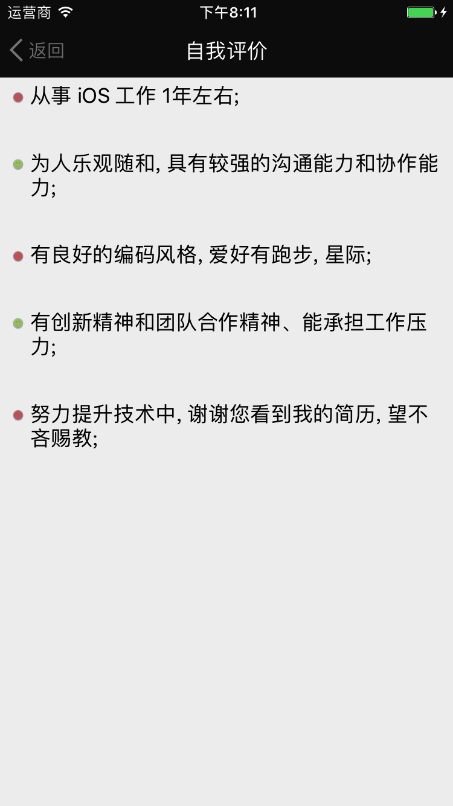

*[Show in Finder](./)*

# 08 - 15
# 学习篇 - 关于个人代码简历与趣味编程题
#### 摘要:

* [APP 截图与动图](#lapp) --  bk-lapp 
* [00. 碎碎念](#00) --  bk00  
* [01. 代码简历](#01) --  bk01 
* 附上我的 github 上的[个人代码简历链接](https://github.com/Jefrl/PersonalResume) 与我做的胜因趣味沙龙考题 [编程题解链接](https://github.com/Jefrl/ShengYinShaLongKaoTi)

###  00. 碎碎念  ==[bk00](#bk00)==
* 开头还是要写点客套话, 虽然大家平日都会说不用, 不用. 但我知道的这是加分项; 

* 感谢有胜因的这次锻炼机会, 很有意思, 趣味编程题也很有意思... 完犊子了, 不会扯话题, 看来要把天聊死了; 好吧强行带节奏, 总之因这类有意思的事结缘, 挺高兴的!
* 详见下面链接
 * [招聘 - 团队说明](http://www.jianshu.com/p/3d30031c3b94)
 * [招聘 - 编程考核](http://www.jianshu.com/p/446eb6d7a252) 
 * [编程竞赛 - 门店层级筛选的问题（完成）](http://www.jianshu.com/p/566c416f113b) 

###  01. 代码简历  ==[bk01](#bk01)==
* 用 OC 写完简历后, 想着再加点东西吧, 虽然担心会有 bug, 想着慢慢迭代, 就不怕见笑了, 多包涵; 
* 最重要的是, 以后可以把自己新掌握的知识, 写成 demo 不断替换上去;  
* 于是就有了, 大多主流 APP 常见的界面结构, 做了三个主要界面, 左边听一会, 最中间的是个人简历, 右边是笑一会; 
* 3个 demo 杂糅在一起, 调试还是费了时间, 左边的听一会是之前一段时间练习 Swift3.0 写的 demo, 就翻出来了, 顺便试了下 OC 与 Swift 的混编, 简单的调用了少量 Swift代码, 来切换控制器 
* 没做过音视频就用 AVAudioPlayer 先从本地音乐写吧, 右边的视频用 AVPlayerViewController 简单的实现了下播放, 后面再迭代;
* 后有截图

###  APP 截图与动图  ==[bk-lapp](#bk-lapp)==

*   

*   	
*   
*   
*   

* 
*   
*   
* 

* 
*   
*   	
*   
* 

*  

*   

* 太晚了, 我要休息了, 你也多注意休息, 不管怎样, 谢谢您看到我的简历, 谢谢胜因让我有写自己代码简历的机会, 难免很多欠缺之处, 我会努力提升的, 再次谢过, 看到这里的人, 与君共勉 !

    END
 
 ~ Jefrl ~ 
  

